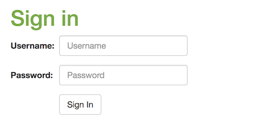
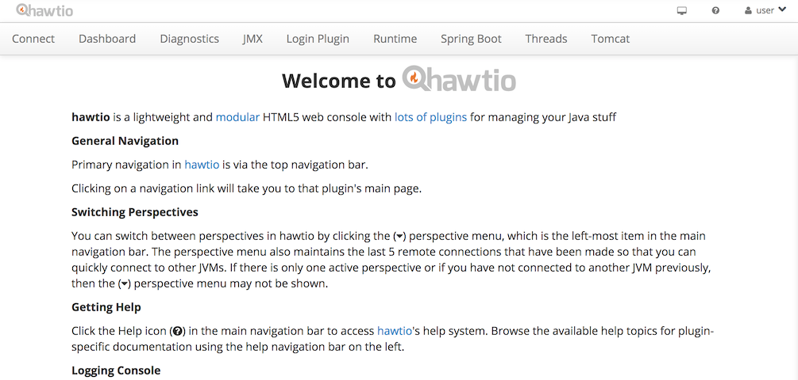
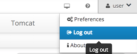
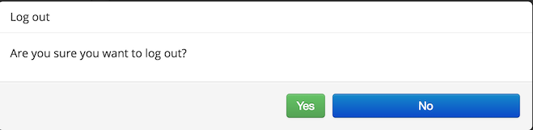
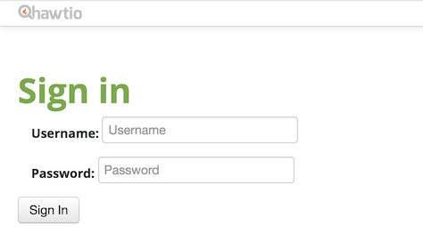

[![Build Status][travis-badge]][travis-badge-url]


Spring Security hawtio Example
=============================================
This is an example of configuring Spring security with Spring Boot and [hawtio](http://hawt.io/).
hawtio is a dashboard for managing and monitoring JVM related services.

### Changes Needed

#### Configure Spring Security 
Configure Spring security for application in a standard way except for 
a few changes specfic to hawtio:

- Disable default hawtio authentication,

```java
@SpringBootApplication
@EnableHawtio
@ComponentScan(basePackages = {"com.basaki"})
public class Application {

    public static void main(String[] args) {
        System.setProperty(AuthenticationFilter.HAWTIO_AUTHENTICATION_ENABLED,
                "false");
        SpringApplication.run(Application.class, args);
    }
}
```

- Disable Cross-Site Request Forgery (CSRF) in your application.

- Make sure the logout request URL matches the `/hawtio/auth/logout/*`.
This is the URL used by hawtio to invalidate a session.

```java
@Configuration
@EnableWebSecurity
@Slf4j
public class SecurityConfiguration extends WebSecurityConfigurerAdapter {
    ...

    @Override
    protected void configure(HttpSecurity http) throws Exception {
        http.authorizeRequests().antMatchers("/").permitAll()
                .anyRequest().authenticated()
                .and().formLogin().loginPage("/login")
                .failureUrl("/login?error")
                .permitAll()
                .and().logout().logoutRequestMatcher(
                new AntPathRequestMatcher(
                        "/hawtio/auth/logout/*"))
                .logoutSuccessUrl("/login?logout")
                .and().csrf().disable();
    }
    ...
}
```   

#### Login Page
- Since you are using a form login, you will be needing a custom login page. 
In this example, a `login.html` is used.

- Configure the `/login` request to match view `login.html`
```java
@Configuration
public class SpringMvcConfiguration extends WebMvcConfigurerAdapter {

    @Override
    public void addViewControllers(ViewControllerRegistry registry) {
        registry.addViewController("/login").setViewName("login");
    }

    ...
}
```

#### Updating hawtio's login.html 
Once you log out from the hawtio page, it takes you to its own login page. Since it's
a single page application with AngularJS, you will need to replace this partial page
with your own custom AngularJS based login page.

- In this example, a `login-hawtio.html` page is used.
```html
<div ng-controller="LoginPlugin.LoginController">

    <h1 style="color: #78ab46;">Sign in</h1>

    <form action="/login" method="post">
        <div>
            <label style="font-weight: 700; padding-right: 15px;
            padding-left: 15px;">Username:
                <input id="username" type="text" name="username"
                       placeholder="Username"/>
            </label>
        </div>
        <div><label style="font-weight: 700; padding-right: 15px;
        padding-left: 15px;">Password:
            <input id="password" type="password" name="password" required
                   placeholder="Password"/>
        </label>
        </div>
        <div>
            <button type="submit" class="btn btn-default">Sign In</button>
        </div>
    </form>
</div>
```

- A controller to replace the existing hawtio login page.

```java
@Controller
public class HawtioController {

    private ResourceLoader loader;

    @Autowired
    public HawtioController(ResourceLoader loader) {
        this.loader = loader;
    }

    @RequestMapping(value = "/hawtio/app/core/html/login.html", method = RequestMethod.GET,
            produces = "text/html;charset=UTF-8")
    public void getHawtioLoginHtml(HttpServletResponse response) {
        String location = "classpath:/templates/login-hawtio.html";
        try {
            String body = getResource(location);
            response.setStatus(HttpStatus.OK.value());
            response.getWriter().write(body);
            response.getWriter().flush();
            response.getWriter().close();
        } catch (IOException e) {
            response.setStatus(HttpStatus.NOT_FOUND.value());
        }
    }
    ...
}
```

#### hawtio Login Plugin
- A custom hawtio plugin is needed to have your own AngularJS login controller,
`LoginPlugin.LoginController`. It's used for redirecting to hawtio's home 
page after you are logged in in from hawto's login page.

```java
@Configuration
public class HawtioConfiguration {

    /**
     * Loading the login plugin. It's used for redirecting to hawtio index.html
     * after login.
     */
    @Bean
    public HawtPlugin samplePlugin() {
        return new HawtPlugin("login-plugin",
                "/hawtio/plugins",
                "",
                new String[]{"plugin/js/login-plugin.js"});
    }
}
```

- The `login-plugin.js` is located under `resources/app/webapp/plugin/js` folder.

```js
var LoginPlugin = (function(LoginPlugin) {

    LoginPlugin.pluginName = 'login-plugin';
    LoginPlugin.log = Logger.get('LoginPlugin');
    LoginPlugin.contextPath = "/hawtio/plugins/";
    LoginPlugin.templatePath = LoginPlugin.contextPath + "login-plugin/html/";

    LoginPlugin.module = angular.module('login-plugin', ['hawtioCore'])
        .config(function($routeProvider) {
            $routeProvider.
            when('/home', {
                templateUrl: '/hawtio/index.html'
            });
        });

    LoginPlugin.module.run(function(workspace, viewRegistry, layoutFull) {

        LoginPlugin.log.info(LoginPlugin.pluginName, " loaded");
        viewRegistry["login-plugin"] = layoutFull;
        workspace.topLevelTabs.push({
            id: "LoginPlugin",
            content: "Login Plugin",
            title: "Login plugin loaded dynamically",
            isValid: function(workspace) { return true; },
            href: function() { return "#/login-plugin"; },
            isActive: function(workspace) {
                return workspace.isLinkActive("login-plugin"); }

        });

    });

    LoginPlugin.LoginController = function($scope, $rootScope, $http) {
        var fullUrl = "/hawtio/index.html";
        $http({method: 'GET', url: fullUrl});
    };

    return LoginPlugin;

})(LoginPlugin || {});

hawtioPluginLoader.addModule(LoginPlugin.pluginName);
```

### Build
To build the JAR, execute the following command from the parent directory:

```
mvn clean install
```

### Run
To run the application fromm command line,

```
java -jar target/spring-security-hawtio-example-1.0.0.jar
```

### Usage
You will be redirected to login page when you try to access hawtio home page,
`http://localhost:8080/hawtio/index.html`:



You should use `user` as user name and `password` as password to log in.

Once you are logged in, you will be forwarded to `http://localhost:8080/hawtio/index.html`



Once you are logged in, you can log out by selecting **user** > **Log out** from dropdown menu
on the right corner.



A modal dialog you will pop up to confirm your selection,



Once you are logged out, you will be taken to Hawtio login page,




[travis-badge]: https://travis-ci.org/indrabasak/spring-security-hawtio-example.svg?branch=master
[travis-badge-url]: https://travis-ci.org/indrabasak/spring-security-hawtio-example/